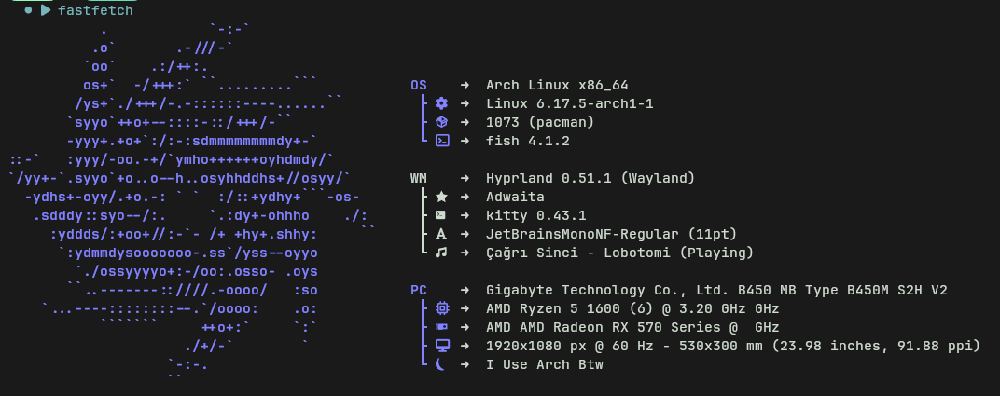

# Fastfetch 

<h3 align="left">
Welcome to my fastfetch config.

i just wanted upload my fastfetch config
</h3>

[Fastfetch](https://github.com/fastfetch-cli/fastfetch) is a tool for fetching system information and displaying them in a pretty way. 
In this repo, I collect my config files that I designed for my [Arch Linux](https://archlinux.org/) [Hyprland](https://github.com/hyprwm/Hyprland) rice. 
Feel free to copy files and modify them or clone the complete repository.

<p align="center">
  
</p>

## Usage

Generate Fastfetch Config File If You Dont Have:

```sh
fastfetch --gen-config
```
and open your config folder, its inside of /home/user/.config/fastfetch/config.jsonc
copy arch.jsonc in this repo and paste inside of your config folder. 
and use fastfetch thats it!

if you want see config folder you can use:
```sh
fastfetch --list-config-paths
```
and if you want use config:

```sh
fastfetch --config "config name"
```

star this repo if you want help me, you can look my profile and my other projects.
